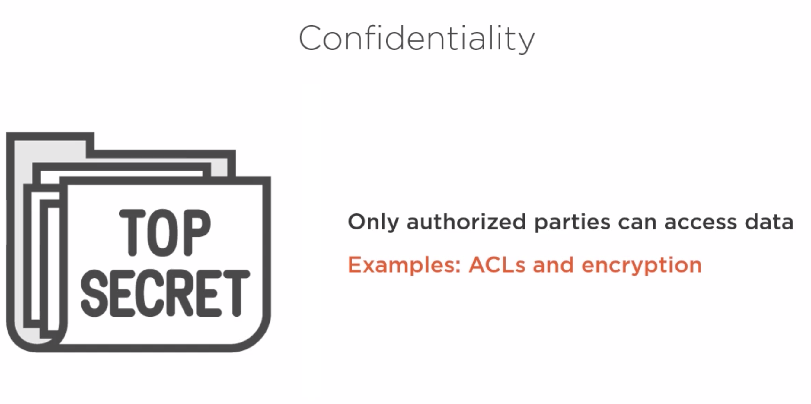
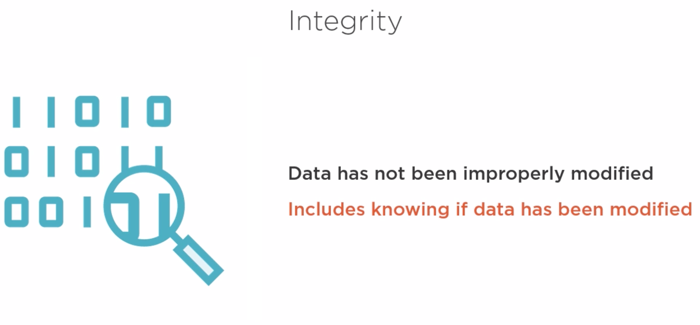
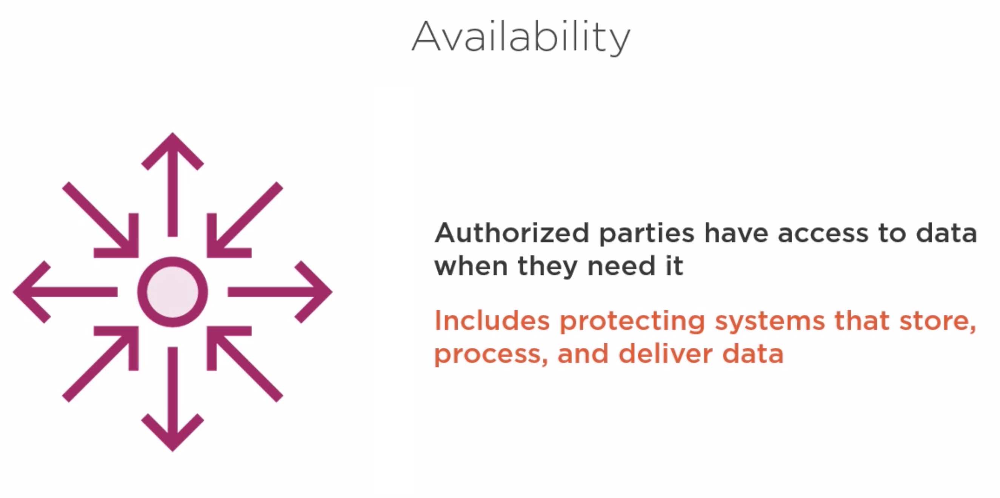

# AWS Identity and Access Management (IAM)

> Pronounce "**I am**".

## Table of Contents
<!-- START doctoc generated TOC please keep comment here to allow auto update -->
<!-- DON'T EDIT THIS SECTION, INSTEAD RE-RUN doctoc TO UPDATE -->

- [CIA Triad](#cia-triad)
- [Principals](#principals)
  - [Users](#users)
  - [Groups](#groups)
  - [Roles](#roles)
- [Policies](#policies)
- [Identity Providers](#identity-providers)
- [Encryption Keys](#encryption-keys)
- [References](#references)

<!-- END doctoc generated TOC please keep comment here to allow auto update -->

## CIA Triad

 

 

## Principals

### Users

Create users if you want to grant other users access to your AWS account without sharing your login credentials.

### Groups

Groups make it easy to manage access for multiple users.

### Roles

Roles are similar to users as they hold an AWS identity with permissions.
Roles are often used if you e.g. want to grant access to AWS resources that the user normally does not have.

Another scenario would be that you want to grant an application access to your AWS resources without exposing your AWS credentials.

## Policies

With policies you can define permissions for users, groups and roles.
Policies are the building blocks to define what action can be performed for what resource.

## Identity Providers

Identity providers enable you to let users gain access to your AWS resources with the help of an external identity provider (IdP).

## Encryption Keys

## References

- [AWS fundamentals: What is IAM?](https://medium.com/@pmuens/aws-fundamentals-what-is-iam-b57f2fb88f66)
